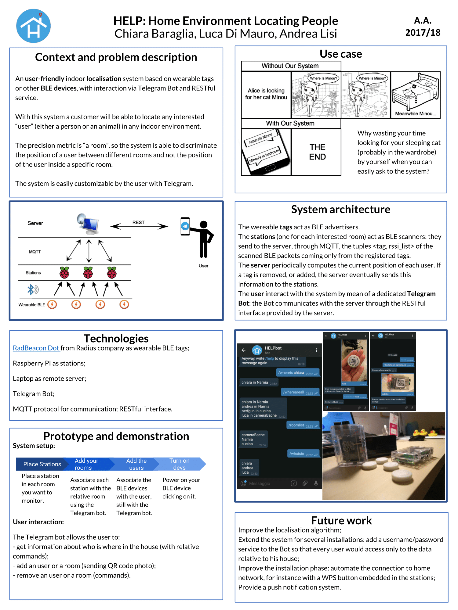

# H.E.L.P. Home Environment Locating People

Project of Mobile and Cyber Physical Systems, University of Pisa, 2017 / 2018.

This project is conceived and developed by

- [Chiara Baraglia](https://github.com/CB-92)
- [Luca Di Mauro](https://github.com/dima91)
- [Andrea Lisi](https://github.com/0Alic)

Thanks to CNR of Pisa for part of the hardware.

## Overview

A simple indoor localization system based on wearable BLE tags, easily customizable through the dedicated Telegram Bot.

## Hardware

This system is tested with this hardware:

- **Wereable BLE tag**: [RadBeacon dot](https://store.radiusnetworks.com/collections/all/products/radbeacon-dot)
- **Stations**: Raspberry PI (with a bluetooth dongle if bluetooth isn't integrated already);
- **Server**: one of our laptops.

## Software

Both stations and server run python scripts: required a **python 2 interpreter**. 

**Stations:** scan for bluetooth messages: library [BluePy](http://ianharvey.github.io/bluepy-doc/).

**Server:** the server runs a [MQTT broker](https://medium.com/@erinus/mosquitto-paho-mqtt-python-29cadb6f8f5c), it connects to a [MongoDB](http://api.mongodb.com/python/current/index.html) database and provides a machine-to-machine REST interface implemented with [Flask](http://flask.pocoo.org/).

**Server(bot):** a telegram bot developed with [python-telegram-bot](https://github.com/python-telegram-bot/python-telegram-bot).

A few more information on the [wiki](https://github.com/TeamOfThings/H.E.L.P./wiki)!

## Application Poster

